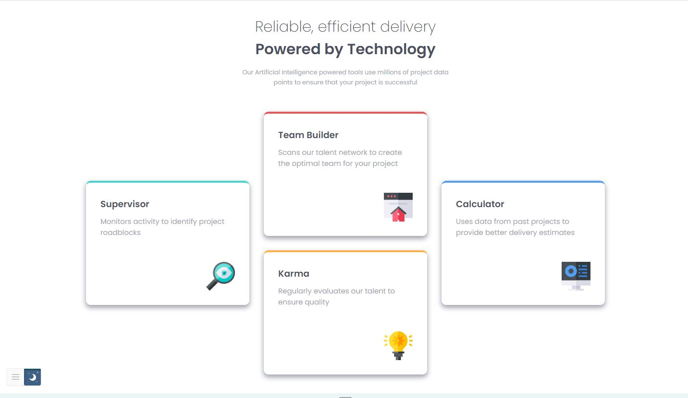
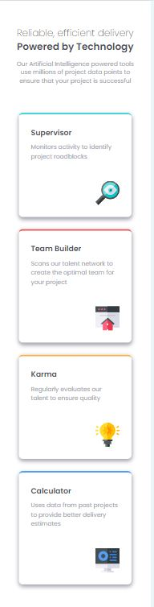

# Frontend Mentor - Four card feature section solution

This is a solution to the [Four card feature section challenge on Frontend Mentor](https://www.frontendmentor.io/challenges/four-card-feature-section-weK1eFYK). Frontend Mentor challenges help you improve your coding skills by building realistic projects. 

## Table of contents

- [Overview](#overview)
  - [The challenge](#the-challenge)
  - [Screenshot](#screenshot)
  - [Links](#links)
  - [Key Features](#key-features)
  - [What I learned](#what-i-learned)
  - [Continued development](#continued-development)
- [Author](#author)


## Overview

This project demonstrates a clean and responsive four-card feature section designed using HTML and CSS. The design highlights modern web development techniques with a focus on grid layout for desktop screens and flexbox for mobile responsiveness. Each card represents a unique feature, making it an ideal design for showcasing key features of a product or service.

### The challenge

Users should be able to:

- View the optimal layout for the site depending on their device's screen size

### Screenshot






### Links

- Solution URL: [Solution on F.M](https://www.frontendmentor.io/solutions/four-card-feature-section-4YTaUFhY-V)
- Live Site URL: [Live Site!](https://clipzorama.github.io/Four-Card-Feature-Section/)


### Key Features

- HTML5
- Responsive layout that adapts from desktop to mobile screens.
- CSS Grid used for structuring the card layout on larger screens.
- Flexbox used for organizing the layout in a vertical format on mobile devices.
- Clean, minimal design focused on readability and efficiency.


### What I learned

**When to Use Grid:** Grid is best used for organizing components in a two-dimensional layout, making it the ideal choice for this design where both rows and columns needed to be structured.

**Grid vs. Flexbox:** This project solidified my understanding of when to switch between CSS Grid and Flexbox depending on screen size. I learned that Flexbox is more suitable for linear and simpler layouts, while Grid is perfect for more complex, two-dimensional designs.

**Design Consistency:** Through the use of custom variables (CSS custom properties), I learned how to maintain consistency in color schemes and spacing throughout the project.

These insights will be incredibly valuable for my future web development projects, especially when dealing with more complex, scalable designs.

```html
<div class="card-container">
        <div class="card" id="cyan">
            <h3 class="card-header">Supervisor</h3>
            <p class="card-p">Monitors activity to identify project roadblocks</p>
            
        </div>
        <div class="card" id="red">
            <h3 class="card-header">Team Builder</h3>
            <p class="card-p">Scans our talent network to create the optimal team for your project</p>
            
        </div>
        <div class="card" id="orange">
            <h3 class="card-header">Karma</h3>
            <p class="card-p">Regularly evaluates our talent to ensure quality</p>
            
        </div>
        <div class="card" id="blue">
            <h3 class="card-header">Calculator</h3>
            <p class="card-p">Uses data from past projects to provide better delivery estimates</p>
            
        </div>
    </div>
```

```css
.card-container {
    display: grid;
    grid-template-columns: repeat(3, 1fr);
    grid-template-rows: repeat(2, 1fr);
    gap: 30px;
    width: 75%;
    margin-top: 50px;
    justify-content: space-between;
    margin-bottom: 63px;

}
```

### Continued development

- **Accessibility Enhancements:** Further improvements for screen readers by adding ARIA labels and ensuring all elements are accessible via keyboard navigation.

- **Animations:** Adding subtle hover animations and transitions for card elements to enhance user experience.

- **Scalability:** Developing the design into a larger component library for repeated use across various sections of a webpage.

- **Dark Mode Support:** Implementing a toggle for light and dark modes to offer users a better visual experience based on their preferences.

## Author

- Frontend Mentor - [@Clipzorama](https://www.frontendmentor.io/profile/Clipzorama)


